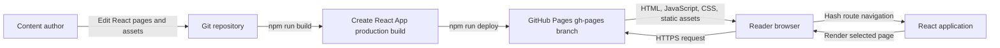
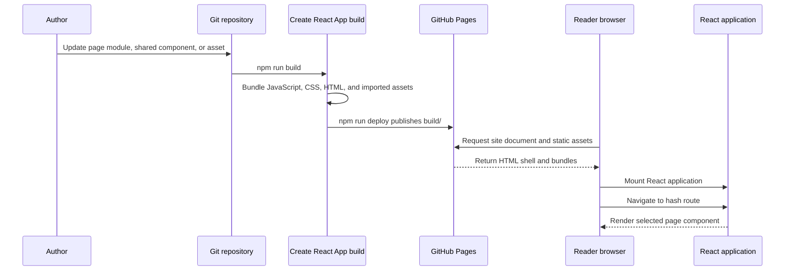

# Cloudful Homepage System Architecture

## Purpose

This repository contains the public Cloudful.io marketing website. It is a client-rendered React single-page application with pages for Home, About, Products, Services, and Contact. Its purpose is to introduce Cloudful.io and help visitors explore its products and services.

The site is a static front end. It has no server application, database, hosted content API, CMS, reader accounts, contact form submission service, or commerce flow. Site content and assets are maintained in this repository and included in the generated static build.

## System Context

The deployment script publishes the `build/` directory to the `gh-pages` branch and writes the `cloudful.io` custom-domain file through the `--cname` option. The repository does not contain a server runtime or a backend service.

## Application Boundaries

The application starts in `src/index.js`, which mounts `App` into the `root` element defined in `public/index.html`. `src/App.js` provides routing, the Material UI theme, the page shell, and the shared navigation.

| Area | Responsibility |
| --- | --- |
| `src/index.js` | Load global CSS, create the React root, and mount the application. |
| `src/App.js` | Configure `HashRouter`, shared navigation, Material UI theme and CSS baseline, and map page routes to page components. |
| `src/components/AppNavbar.js` | Render the Cloudful brand link, desktop navigation, and temporary mobile drawer. Navigation entries link to About, Contact, Products, and Services. |
| `src/pages/Home.js` | Render the hero image and the “Build Once, Deploy Many.” tagline. |
| `src/pages/About.js` | Render the current About page placeholder. |
| `src/pages/Products.js` | Render the current Products page placeholder. |
| `src/pages/Services.js` | Render the current Services page placeholder. |
| `src/pages/Contact.js` | Render the current Contact page placeholder. |
| `src/index.css` | Define the global body and code font stacks and reset the body margin. |
| `public/` | Provide the HTML shell, favicon, web app manifest, robots file, and public static assets. |
| `src/assets/images/` | Provide images imported into React modules, including the navigation logo. |
| `package.json` | Declare runtime/build dependencies and the start, build, test, and deployment scripts. |

The app uses React 19, React Router 7, Material UI 7, and Create React App (`react-scripts` 5). Material UI styling is configured in `App`; page-level layout is currently implemented with Material UI components and inline `sx` styles.

## Content Model

There is no runtime content model or external content store. Page content is authored directly in React modules under `src/pages/`. Shared navigation labels and their route paths are defined in `src/components/AppNavbar.js`. Site-wide shell and route configuration live in `src/App.js`.

Images are either imported from `src/assets/images/` and bundled with the application, or served from `public/` by a root-relative URL. The Home hero currently uses `/assets/images/hero.jpg`; the navigation logo is imported from `src/assets/images/logo.png`. These assets are public once deployed.

The current About, Products, Services, and Contact components contain placeholder labels rather than detailed offering content. The application does not load page data from Markdown, JSON, a CMS, or an API.

## Content and Request Flow

At runtime, the browser receives the static HTML shell and application assets. React mounts in the browser and React Router selects a page based on the URL fragment. Page transitions are client-side and do not request page-specific content from a server.

## Routing and Localization

`HashRouter` stores the route after `#`, so the current page URLs follow this pattern:

| Page | Route | Navigation link |
| --- | --- | --- |
| Home | `/#/` | Cloudful brand link (`/`) |
| About | `/#/about` | About |
| Contact | `/#/contact` | Contact |
| Products | `/#/products` | Products |
| Services | `/#/services` | Services |

The fragment-based routing allows the static host to serve the same `index.html` for application routes; the browser-side router selects the page. The site currently has no locale routes or translation system. The route table does not define a catch-all page, so unknown application paths currently render no matching page content.

## Rendering and Metadata

All route components render in the browser after React starts. The shared shell wraps the route outlet in a light Material UI theme, `CssBaseline`, and an `AppBar` navigation. At wide viewports the navigation displays links in the bar; at narrow viewports it uses a menu button and temporary drawer.

The HTML document template is `public/index.html`. It provides the root mount element, viewport declaration, favicon and manifest links, a generic `Cloudful` title, and the current generic `Cloudful` description. Page components do not currently set route-specific document titles, descriptions, canonical URLs, or social sharing metadata. The application has no server-side rendering or static per-route HTML generation.

The current Home page renders a background hero image and tagline. The other page components currently render only placeholder text. The app does not include a form handler, search, account flow, or purchase interaction.

## Security and Privacy

- The deployed site serves static application files and does not currently accept reader-submitted data.
- There is no authentication, authorization, database, or private content boundary. Anything committed under `public/` or bundled into the application must be treated as public.
- The current page code does not make application API requests or embed third-party analytics. Any external links, embeds, analytics, or forms added later introduce separate privacy and security considerations.
- Dependencies are installed through npm and are included in the lockfile. Changes to runtime dependencies should be reflected in `package-lock.json` and reviewed through the repository's normal change process.
- The React application requires JavaScript to render the pages. `public/index.html` currently shows a no-JavaScript notice when scripts are disabled; the marketing pages themselves are not rendered as static HTML.

## Build and Deployment

The app uses Create React App scripts:

- `npm start` starts the local development server.
- `npm run build` creates the static production output in `build/`.
- `npm test` starts the Create React App test runner.
- `npm run deploy` runs `predeploy` (the production build) and publishes `build/` to the `gh-pages` branch, including a `CNAME` for `cloudful.io`.

`package.json` sets the homepage to `https://cloudful.io`. Production hosting must serve the generated files over HTTPS, use the custom domain configuration, and retain the build's static asset paths. The checked-in repository does not define an automated CI workflow; deployment is available as the package script and depends on the caller having the required GitHub Pages permissions and configuration.

## Verification and Operations

- `npm run build` verifies that Create React App can produce the static production bundle.
- `npm test` invokes the Create React App test runner. No application test files are currently present in the repository.
- No separate lint or typecheck scripts are defined in `package.json`; the configured ESLint rules are provided by `react-scripts`.
- The current page routes are declared in `src/App.js`, while their visible navigation links are declared separately in `src/components/AppNavbar.js`. Both locations need to stay aligned when routes change.
- Deployment is initiated through `npm run deploy`; production availability and custom-domain DNS are managed outside the React application.
- The site currently has no runtime logging, analytics, uptime monitoring, or error-reporting integration configured in this repository.
