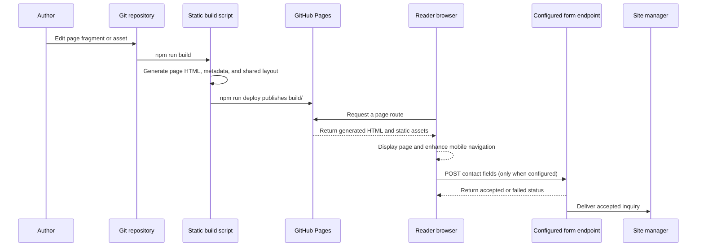

# Cloudful Homepage System Architecture

## Purpose

This repository builds and publishes the public Cloudful.io marketing website. It uses static HTML pages, CSS, and a small amount of browser JavaScript. The pages explain Cloudful's reusable software approach and provide places to learn about products, services, and contacting the site manager.

The site has no application server, database, CMS, reader account system, or commerce flow. The build uses Node.js built-in modules to generate a shared page shell around the authored page content. A configured contact form posts visitor messages to an external HTTPS endpoint; without an endpoint configured, the site displays a clear not-yet-available state.

## System Context

The deployment script publishes the `build/` directory to the `gh-pages` branch and creates a `CNAME` file for `cloudful.io`. The configured form endpoint is an external dependency; it is not implemented or operated by this repository.

## Application Boundaries

| Area | Responsibility |
| --- | --- |
| `src/pages/*.html` | Author the Home, About, Products, Services, and Contact page content as HTML fragments. |
| `scripts/build.js` | Wrap each content fragment in the common accessible layout, navigation, metadata, footer, and contact endpoint configuration; generate static route directories and copy assets. |
| `src/site.css` | Define site-wide layout, responsive styles, typography, focus styles, and reduced-motion behavior. |
| `src/site.js` | Enhance mobile navigation and, when configured, submit the contact form to its endpoint. |
| `src/assets/images/` | Hold images copied into the static site, including the logo and hero image. |
| `scripts/serve.js` | Serve the built site locally with Node's built-in HTTP server. |
| `public/favicon.ico`, `public/robots.txt` | Provide the favicon and crawler rules copied to the build output. |
| `package.json` | Define build, local preview, and GitHub Pages deployment commands. `gh-pages` is the only package dependency. |

The browser does not need React or a component runtime to render page content. The small JavaScript file only enhances navigation and handles the optional form interaction; content remains present in the generated HTML.

## Content Model

There is no database or runtime content API. Page text and structure are authored in HTML fragments under `src/pages/`. The build script holds each page's title, description, and canonical route in a small page metadata map. Shared navigation and footer markup are maintained in the build script so they stay consistent across generated pages.

Assets are stored under `src/assets/images/` and copied to `/images/` in the output. The Home hero uses `/images/hero.jpg`, and the Cloudful logo uses `/images/logo.png`. All site content and copied assets are public after deployment; private information and secrets must not be committed there.

The Home page describes Cloudful's stated categories: reusable components, libraries, and web applications. Product names, detailed capabilities, prices, availability, and acquisition routes are not populated until Cloudful confirms them. The Services page likewise avoids describing specific services that have not been confirmed.

## Content and Request Flow

Page HTML and metadata are generated during the build. Each route is served as a static file, and ordinary page navigation does not depend on client-side routing or JavaScript. When configured, the contact form sends name, email address, and message as multipart form data to the endpoint using `fetch`. A successful HTTP response indicates that the endpoint accepted the inquiry; network errors and non-success responses produce a failure message and preserve the entered form values.

## Routing and Localization

The build writes each route as an `index.html` file so it can be requested directly from static hosting:

| Page | Public route | Source |
| --- | --- | --- |
| Home | `/` | `src/pages/home.html` |
| About | `/about/` | `src/pages/about.html` |
| Products | `/products/` | `src/pages/products.html` |
| Services | `/services/` | `src/pages/services.html` |
| Contact | `/contact/` | `src/pages/contact.html` |

The build also creates `404.html` for unknown paths. Navigation uses ordinary links. There is no localization system; all generated pages declare English as their language.

## Rendering and Metadata

The build generates complete HTML documents with one shared header, main landmark, footer, and site stylesheet. Page content is included in the HTML output, so search crawlers and visitors can read it without waiting for client-side rendering. The shared header has a keyboard-accessible skip link, a Cloudful home link, and primary navigation. On small screens, a button opens and closes the navigation; its expanded state is exposed with `aria-expanded`.

Each route has its own document title, description, and canonical URL. Informative content uses semantic headings and labeled links. The logo is decorative beside an explicitly named home link; the hero image is decorative and the headline conveys the page's message in text. CSS includes visible keyboard focus treatment and a reduced-motion preference.

The Contact page includes labeled name, email, and message fields and relies on native browser validation for required fields and email format. The form is only revealed when `CONTACT_FORM_ENDPOINT` is configured with an HTTPS URL at build time. Otherwise, the page explains that delivery is being set up and does not present a working-looking form.

## Security and Privacy

- All generated pages and assets are public. Do not include credentials, private customer information, or unpublished sensitive details in source fragments or public assets.
- No visitor data is collected by the site while the contact endpoint is unconfigured.
- When configured, the endpoint receives the visitor's name, email address, and message. The page tells visitors that these details are used to respond to their inquiry and asks them not to submit sensitive information.
- `CONTACT_FORM_ENDPOINT` must be an HTTPS URL. Its URL is embedded in the public page and must not contain credentials or secret tokens. The endpoint must not require a secret from browser code.
- The form endpoint must restrict accepted origins or otherwise protect its public submission route, provide spam prevention that does not block assistive technology, and deliver messages only to the authorized site manager.
- The endpoint owner must establish access controls, retention, deletion, privacy disclosures, and monitoring before enabling submissions. Those policies and the final service are not configured in this repository.
- The site does not currently use analytics, tracking, embedded third-party media, authentication, or application API calls.
- The local preview server adds `X-Content-Type-Options: nosniff` and a strict referrer policy. Static-host response headers are controlled by the production host, not this repository.

## Build and Deployment

The build and preview use Node.js built-in modules and do not require installing a frontend framework:

- `npm run build` generates Home, About, Products, Services, and Contact in `build/`, along with shared assets and `404.html`.
- `npm start` builds the site and serves the result at `http://localhost:3000` (or the port in `PORT`).
- `npm run deploy` builds and publishes `build/` to the `gh-pages` branch with a `cloudful.io` CNAME.
- Set `CONTACT_FORM_ENDPOINT` to the selected HTTPS endpoint before the production build to enable form submissions. The endpoint must accept browser form posts from `https://cloudful.io` and return a success status only after it accepts a message.

`package.json` sets the site homepage to `https://cloudful.io`. Production hosting and DNS must serve the output over HTTPS and point the custom domain to GitHub Pages. This repository does not define a CI workflow; deployment depends on a maintainer's GitHub Pages permissions and repository configuration.

## Verification and Operations

- `npm run build` verifies that all required page fragments, assets, and output files can be generated.
- `npm start` provides a local preview, including direct nested page routes and a not-found response.
- `npm run deploy` publishes the generated static output; production availability, DNS, and form endpoint operations are managed outside the site build.
- Page metadata is defined in `scripts/build.js`; shared navigation and layout are generated there, while page-specific content is in `src/pages/`.
- The form endpoint is not yet selected or configured. Until it is, the Contact page remains in its explanatory unavailable state.
- No analytics, uptime monitoring, or error-reporting service is configured by this repository.
